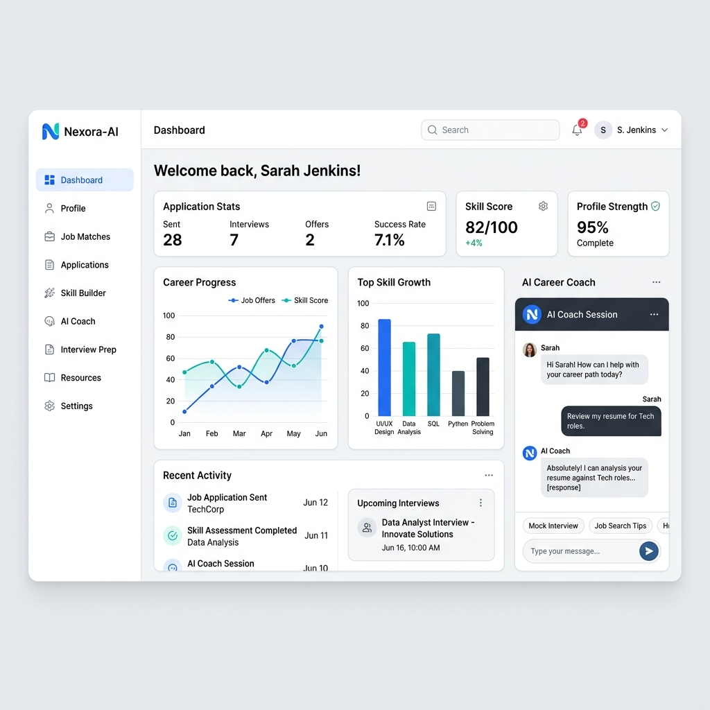
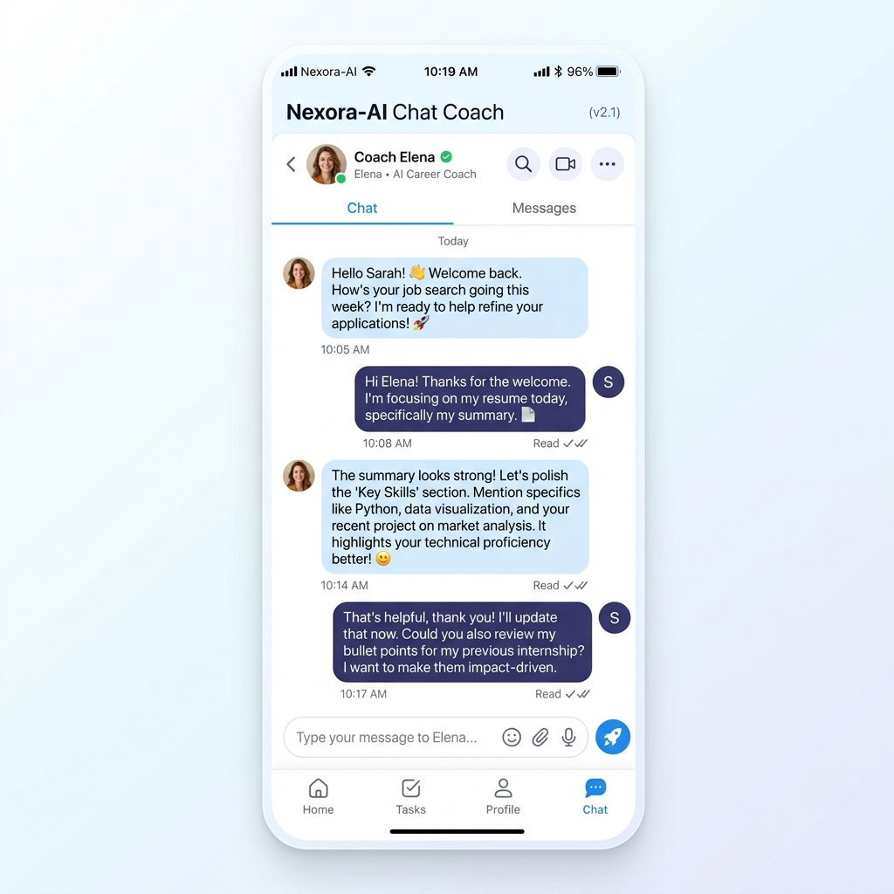

# Nexora-AI 🚀

Your comprehensive AI-powered career and placement preparation assistant, built to empower students and job seekers in acing their professional journeys.

---

## 🎨 Screenshots & Mockups

### 1. Application Dashboard
Mockup showcasing the premium layout, visual charts, and sidebar options:


### 2. AI Chat Coach (Chatbot)
Interactive messaging thread with your personal AI placement assistant:


---

## 🌟 Project Features

### 💬 AI Chatbot (AI Career Coach)
- **Description**: A dedicated conversation space where you can consult an expert AI career coach on demand. It analyzes placement preparation questions, offers guidance on how to structure answers, evaluates technical explanations, and helps clear doubts.
- **Capabilities**: Custom prompt system optimized for structured professional advice. Retains the context of the last 5 messages to provide highly coherent, personalized, and relevant feedback in Markdown format.

### 📄 Resume Analyzer
- **Description**: Check your ATS (Applicant Tracking System) compatibility scores.
- **Capabilities**: Extracts text from uploaded PDF resumes using `pypdf`, matches key recruiter keywords, scores your resume out of 100, and returns precise bullet points detailing your resume's strengths, weaknesses, and actionable suggestions.

### 🎤 Interview Simulator
- **Description**: Conduct mock interview sessions.
- **Capabilities**: Select between **HR**, **Technical**, or **DSA** interview modes, enter your target job role, generate challenging questions tailored to that role, and submit answers to receive score breakdowns (0-10) and full feedback critiques.

### 🎯 Career Planner
- **Description**: Develop customized roadmaps tailored to your academic background.
- **Capabilities**: Select your department and year, input your goal company (e.g., Google, Amazon, TCS), and generate a 6-month roadmap including skill-gap assessments, week-by-week schedules, and learning resource recommendations.

---

## 🛠️ Technology Stack

- **Core Framework**: Python
- **User Interface**: [Gradio](https://gradio.app/) (Featuring custom light mode, responsive sidebar layout, and instant client-side page transitions)
- **AI Core Client**: Groq SDK (`llama-3.1-8b-instant` model)
- **Database Backend**: Supabase Client (PostgreSQL)
- **Visualization**: Plotly Express & Pandas DataFrames
- **Text Extraction**: PyPDF parser

---

## 🚀 Setup & Installation Instructions

Follow these steps to set up and run Nexora-AI locally:

### 1. Clone the Repository
```bash
git clone <repository-url>
cd nexora-ai
```

### 2. Create and Activate a Virtual Environment
```bash
# Windows
python -m venv venv
venv\Scripts\activate

# macOS/Linux
python3 -m venv venv
source venv/bin/activate
```

### 3. Install Dependencies
```bash
pip install -r requirements.txt
```

### 4. Configure Environment Variables
Create a file named `.env` in the root directory and add the following keys:
```env
GROQ_API_KEY=your_groq_api_key
SUPABASE_URL=your_supabase_url
SUPABASE_KEY=your_supabase_anon_key
```
> [!NOTE]  
> The application uses the Groq API Client for ultra-fast response generations and connects to Supabase for saving analysis logs.

### 5. Setup Database Tables
If you plan to use a live Supabase database, ensure you create these tables in your database console:
- **`chats`**: columns `id` (int8, primary key), `user_id` (text), `message` (text), `response` (text), `created_at` (timestamptz).
- **`resumes`**: columns `id` (int8, primary key), `user_id` (text), `filename` (text), `report` (text), `score` (int8), `created_at` (timestamptz).
- **`interviews`**: columns `id` (int8, primary key), `user_id` (text), `mode` (text), `score` (int8), `feedback` (text), `created_at` (timestamptz).

### 6. Run the Application
Start the Gradio development server:
```bash
python app.py
```
Open [http://127.0.0.1:7860](http://127.0.0.1:7860) in your web browser.

---

## 🏗️ Architecture & Modules

The project is structured modularly for clarity and maintainability:
- `app.py`: Standard entry point configuring Layout structure, client-side JS navigation hooks, and launcher settings.
- `modules/`: Contains separate page components and feature modules:
  - `view_factory.py`: Mounts the layouts and assigns target identifiers.
  - `chatbot.py`: Contains Chatbot messaging interface and session storage.
  - `resume_analyzer.py`: ATS grading and pdf text extraction methods.
  - `interview_simulator.py`: HR/Technical/DSAmock session triggers and evaluation prompts.
  - `career_planner.py`: Course recommendations and roadmap compilers.
- `database/`: Contains `supabase_client.py` managing connections and CRUD inserts.
- `assets/`: Contains custom styles and client scripts:
  - `style.css`: Modern visual elements, transitions, and pinned bottom alignments.
  - `app.js`: Client-side functions for instant navigation.
